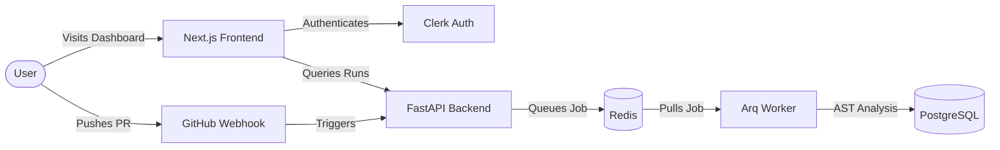

<div align="center">
  <h1>Ratchet ⚙️</h1>
  <p><strong>The Next-Generation Agentic Code Repair Pipeline</strong></p>
  
  <p>
    <a href="https://nextjs.org/"></a>
    <a href="https://fastapi.tiangolo.com/"></a>
    <a href="https://clerk.com/"></a>
    <a href="https://render.com/"></a>
  </p>
</div>

---

Ratchet is an enterprise-grade, end-to-end automated pipeline for code repair and AST (Abstract Syntax Tree) analysis. By bridging GitHub webhooks, background worker queues, and an intelligent FastAPI backend, Ratchet autonomously detects, analyzes, and repairs code regressions before they ever hit production.

## ✨ Features

- **AST-Driven Analysis**: Deep structural code understanding using Tree-sitter.
- **Agentic Workflow**: Intelligent background workers driven by Arq and Redis.
- **Seamless GitHub Integration**: Listens to PRs and comments via webhooks and acts with your explicit OAuth authorization.
- **Premium User Experience**: High-end Next.js dashboard with Clerk Core 3 authentication and fluid glassmorphism UI.
- **Monorepo Architecture**: Cleanly separated `apps/web` (Frontend) and `apps/api` (Backend) anchored by ultra-fast `uv` and `pnpm`.

## 🏗 Architecture



## 🛠️ Tech Stack

| Component | Technology | Description |
| :--- | :--- | :--- |
| **Frontend** | Next.js 15+ (Turbopack) | React framework with custom TailwindCSS & Premium UI |
| **Backend** | FastAPI (Python) | High-performance asynchronous API |
| **Worker** | Arq & Redis | Background job queuing and processing |
| **Database** | PostgreSQL & SQLAlchemy | Async database interactions |
| **Auth** | Clerk | Production-ready GitHub OAuth integration |
| **Toolchain** | `uv` & `pnpm` | Ultra-fast dependency management |

## 🚀 Quick Start (Local Development)

### Prerequisites
- [uv](https://github.com/astral-sh/uv) (Python package manager)
- [pnpm](https://pnpm.io/)
- Redis server running locally

### 1. Clone the repository
```bash
git clone https://github.com/Mayank-iitj/Ratchet.git
cd Ratchet
```

### 2. Setup the Frontend (`apps/web`)
```bash
cd apps/web
pnpm install
# Create .env.local with Clerk Keys:
# NEXT_PUBLIC_CLERK_PUBLISHABLE_KEY=...
# CLERK_SECRET_KEY=...
pnpm run dev
```

### 3. Setup the Backend (`apps/api`)
```bash
# Return to root
cd ../../
uv sync
# Start FastAPI
uv run uvicorn apps.api.ratchet_api.main:app --reload
# Start the Worker (in a new terminal)
uv run arq apps.api.ratchet_api.worker.WorkerSettings
```

## 🌍 Deployment

Ratchet is fully configured for zero-downtime deployments.

### Frontend (Vercel)
The Next.js dashboard is tailored for Vercel. 
1. Import the repository in Vercel.
2. Set the **Root Directory** to `apps/web`.
3. Add your `CLERK_*` environment variables.
4. Deploy!

### Backend (Render)
The backend is packaged with a `render.yaml` Blueprint for 1-click deployments.
1. Connect this repository to your Render account.
2. Render will automatically read `render.yaml` and provision:
   - PostgreSQL Database
   - Redis Instance
   - FastAPI Web Service (`ratchet-api`)
   - Arq Background Worker (`ratchet-worker`)

---

<div align="center">
  <em>Built with precision for flawless pipelines.</em>
</div>
